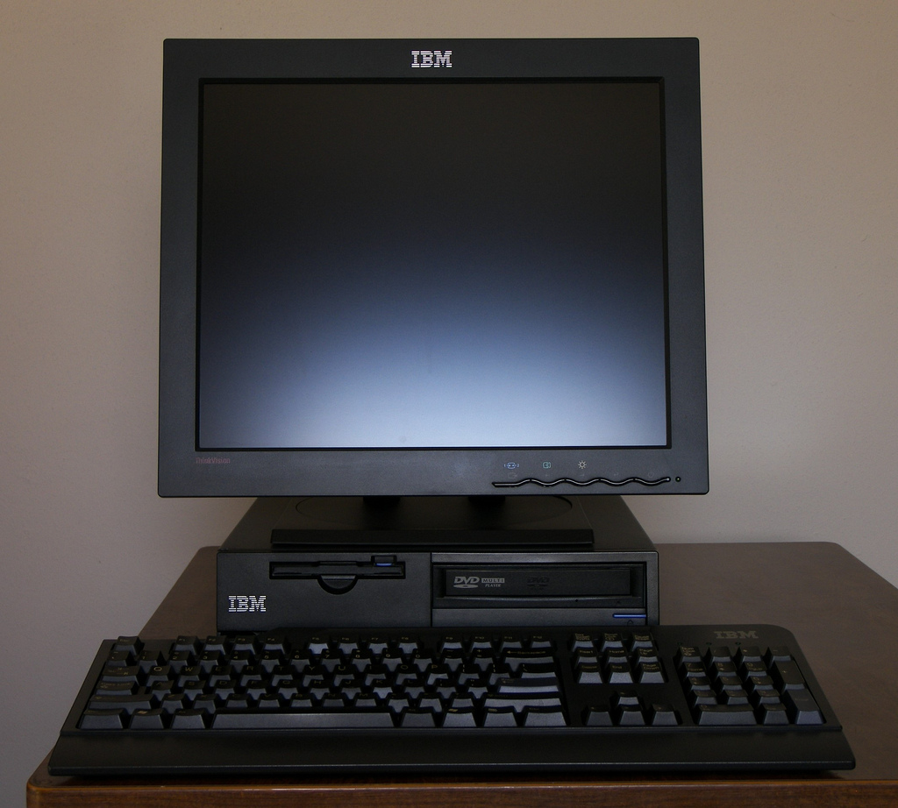
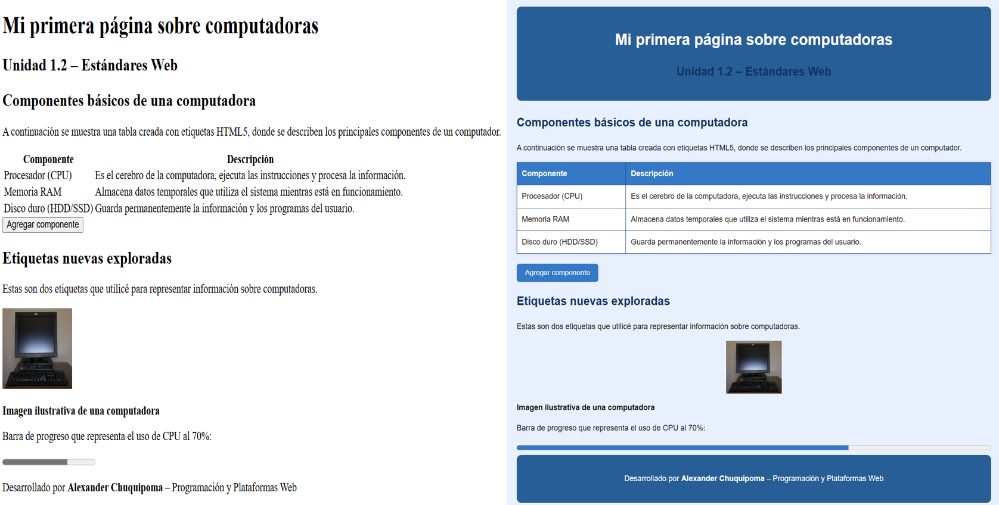

# Programación y Plataformas Web (PPW)

---

# Práctica 1 – Explorando los Estándares Web con HTML

**Asignatura:** Programación y Plataformas Web  
**Unidad:** 1.2 – Estándares Web  
**Estudiante:** Alexander Chuquipoma  
**Repositorio:** https://github.com/AlexChuquipoma/icc-ppw-u1-miPrimeraPagina  
**Página desplegada (GitHub Pages):** https://alexchuquipoma.github.io/icc-ppw-u1-miPrimeraPagina/

---

## 🧱 Estructura HTML utilizada

| Componente | Descripción | Implementación |
|-------------|--------------|----------------|
| `<!DOCTYPE html>` | Declaración del documento HTML5 | Línea 1 |
| `<html lang="es">` | Idioma del documento | Español |
| `<header>` | Encabezado principal | Contiene `<h1>` y `<h2>` |
| `<section>` | Agrupa contenido principal | Dos secciones con `<h2>` |
| `<table>` | Muestra los elementos estudiados | Tres filas con `<th>` y `<td>` |
| `<footer>` | Pie de página | Nombre del estudiante y asignatura |

---

## 🧩 Nuevas etiquetas exploradas

| Etiqueta | Descripción | Implementación |
|-----------|--------------|----------------|
| `` | Inserta una imagen representativa del tema | Logo del lenguaje HTML5 |
| `<progress>` | Barra de progreso de una tarea | Representa 70% completado |

**Código usado:**

```html


<progress value="70" max="100">70%</progress>

----
```

---

🧠 Práctica 2 – Adición de CSS y JavaScript

1. Archivos agregados

| Archivo | Descripción | Ubicación |
|--------|-------------|----------|
| `style.css` | Contiene todos los estilos visuales del sitio (colores, tipografía, márgenes, botones, tabla, etc.) | Carpeta raíz del proyecto |
| `script.js` | Contiene las funciones y eventos JavaScript que agregan comportamiento dinámico | Carpeta raíz del proyecto |

Estructura final del proyecto:

```
icc-ppw-u1-mi_pagina_web/
│
├── index.html
├── style.css
├── script.js
└── README.md
└── compu.jpg
```

2. Implementación en HTML

Los nuevos archivos se enlazaron dentro del documento `index.html` de la siguiente forma:

En el `<head>` (para el CSS):

```html
<link rel="stylesheet" href="style.css">
```

Antes de cerrar el `<body>` (para el JavaScript):

```html
<script src="script.js"></script>
```

3. Estilos aplicados con CSS

| Elemento | Estilo implementado | Descripción |
|----------|---------------------|-------------|
| `body` | `background-color: #e6f2ff; font-family: Arial;` | Fondo azul claro y tipografía limpia |
| `header` | `background-color: #004aad; color: white;` | Encabezado azul fuerte con texto blanco |
| `header:hover` | `background-color: #007bff; transition: 0.3s;` | Cambia el fondo al pasar el mouse |
| `table` | `border: 1px solid #004aad; box-shadow: 0 0 8px rgba(0,0,0,0.1);` | Bordes azules y sombra ligera |
| `button` | `background-color: #007bff; border-radius: 6px;` | Botón azul redondeado con hover |
| `progress` | `accent-color: #007bff; width: 100%; height: 20px;` | Personalización de la barra de progreso |

Ejemplo en el código:

```css
button {
    background-color: #007bff;
    color: white;
    border: none;
    border-radius: 5px;
    padding: 10px 15px;
    cursor: pointer;
}

button:hover {
    background-color: #0056b3;
}
```

También se pueden aplicar estilos al `progress`:

```css
progress {
    accent-color: #007bff;
    width: 100%;
    height: 20px;
}
```

4. Interactividad agregada con JavaScript

El archivo `script.js` incorpora dos acciones básicas:

- Agregar una nueva fila a la tabla al presionar el botón (ej. botón con id `agregarFila`):

```js
document.getElementById("agregarFila").addEventListener("click", () => {
    const tabla = document.querySelector("table");
    const nuevaFila = tabla.insertRow();
    nuevaFila.innerHTML = "<td>Tarjeta gráfica (GPU)</td><td>Procesa los gráficos y acelera tareas visuales y de IA.</td>";
});
```

- Cambiar el color de fondo del encabezado al pasar el mouse por encima:

```js
const header = document.querySelector("header");
header.addEventListener("mouseover", () => {
    header.style.backgroundColor = "#007bff";
});
header.addEventListener("mouseout", () => {
    header.style.backgroundColor = "#004aad";
});
```

---

Capturas de pantalla del proyecto final


_sin y con CSS/JS._